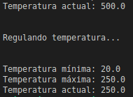
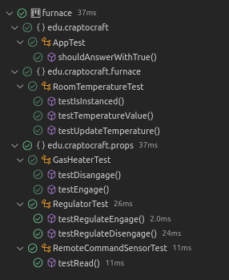
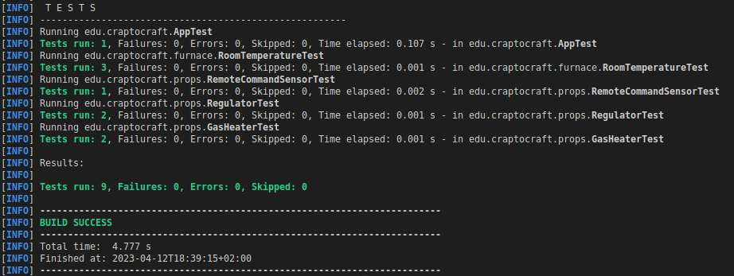

# Furnace-DIP-Kata

Repositorio con mi solución al problema planteado en el libro `Àgile Principles, Patterns and Practices in C# de Martin C. Robert, Martin Micah`. 

La idea es de resolverlo siguiendo uno de los principios SOLID, Inversión de dependencias (DIP).


- [Diseño](#Diseño)
- [Uso](#Uso)
- [Pruebas](#Pruebas)


# Diseño
El diseño y arquitectura de la siguiente solución está realizado siguiendo las indicaciones de la figura 11-5 del libro.


# Uso
El programa regula la temperatura del dispositivo para mantenerlo entre los límites máximos y mínimos.

Código:

```
        final double minTemp = 20d;
        final double maxTemp = 250d;

        RoomTemperature temperature = RoomTemperature.getInstance();
        temperature.setTemperature(500d);
        System.out.println(temperature.toString());
        Heater heater = new GasHeater();
        Thermometer thermometer = new RemoteCommandSensor();

        Regulate regulator = new Regulator(minTemp, maxTemp);

        System.out.println("\n\nRegulando temperatura...\n\n");
        regulator.regulate(thermometer, heater, temperature);

        System.out.println(regulator.toString());
        System.out.println(temperature.toString());

```
Salida:



# Pruebas

Para resolver el kata se ha desarrollado guiado por casos test TDD elavorando las pruebas unitarias que aparecen a continuación:




El proyecto se ha gestionado mediante Maven:
