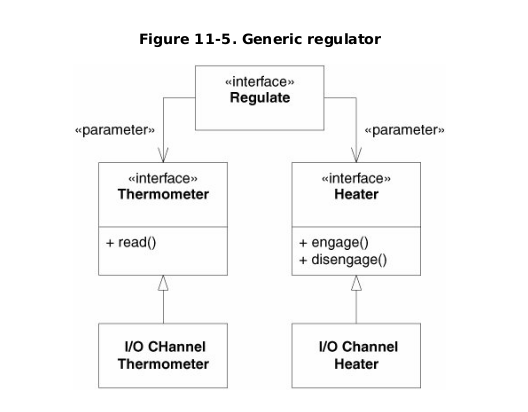

# Furnace-DIP-Kata

Repositorio con mi solución al problema planteado en el libro `Àgile Principles, Patterns and Practices in C# de Martin C. Robert, Martin Micah`. 

La idea es de resolverlo siguiendo uno de los principios SOLID, Inversión de dependencias (DIP).

- [Diseño](#Diseño)
- [Requisitos técnicos](#Pre-requisitos)
- [Uso](#Uso)
- [Pruebas](#Pruebas)

# Diseño
El diseño y arquitectura de la siguiente solución está realizado siguiendo las indicaciones de la figura 11-5 del libro.

# Pre-requisitos

# Uso

# Pruebas